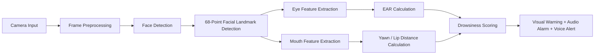

# Real-Time Driver Drowsiness Detection using Eye & Mouth Features


> A real-time computer vision system that monitors driver fatigue from a webcam or embedded camera, estimates drowsiness from eye closure and yawning behavior, and triggers visual, sound, and voice alerts when fatigue signs are detected.

This project demonstrates how image processing, facial landmark analysis, and real-time video streaming can be combined to build a practical driver-assistance prototype for road safety. The system detects the driver's face, tracks eye and mouth landmarks, calculates drowsiness indicators such as Eye Aspect Ratio (EAR), lip distance/yawning level, and a KSS-inspired fatigue score, then raises an alert when the risk level becomes high.

---

## Why this project matters

Driver drowsiness is a major safety risk, especially during long-distance or night-time driving. Instead of relying on wearable sensors, this project uses a camera-based approach, making the solution more natural for users and easier to integrate into vehicles or edge devices.

From an engineering perspective, this project highlights the ability to:

- Build a real-time Computer Vision pipeline using Python and OpenCV.
- Extract meaningful facial features using Dlib's 68-point facial landmark model.
- Design rule-based fatigue detection from interpretable geometric features.
- Combine visual overlays, FPS monitoring, and multi-threaded audio alerts.
- Deploy and test the system with camera hardware such as Jetson Nano + webcam/camera.

---

## Key features

- **Real-time face detection** using Haar Cascade and live camera input.
- **Facial landmark tracking** with Dlib's 68-point shape predictor.
- **Eye Aspect Ratio (EAR) analysis** to detect prolonged eye closure.
- **Yawning detection** based on upper-lip and lower-lip distance.
- **KSS-inspired drowsiness level** to estimate fatigue severity from eye and mouth cues.
- **Multi-modal warning system** with on-screen alert text, alarm sound, and text-to-speech voice notification.
- **FPS monitoring** to evaluate real-time performance.
- **Debug visualization** with original, processed, and inverted frames.
- **Edge-device ready design** suitable for experimentation on Jetson Nano and similar camera-based platforms.

---

## System workflow



---

## How it works

### 1. Video capture

The system captures frames from the default camera using OpenCV:

```python
vs = cv2.VideoCapture(0)
```

Each frame is resized for faster processing, converted to grayscale, and passed through the face detector.

### 2. Face detection

The project uses OpenCV's Haar Cascade frontal face detector to locate the driver's face in each frame.

```python
detector = cv2.CascadeClassifier("haarcascade_frontalface_default.xml")
```

### 3. Facial landmark detection

After a face is detected, Dlib's `shape_predictor_68_face_landmarks.dat` model estimates 68 key facial points. These landmarks are used to isolate the eyes and mouth regions.

```python
predictor = dlib.shape_predictor("shape_predictor_68_face_landmarks.dat")
```

### 4. Eye Aspect Ratio (EAR)

EAR measures how open or closed the eyes are. When EAR stays below a threshold for several consecutive frames, the system interprets this as possible drowsiness.

```python
EYE_AR_THRESH = 0.25
EYE_AR_CONSEC_FRAMES = 20
```

### 5. Yawning detection

The system estimates mouth opening by calculating the distance between the upper and lower lip landmarks. If the distance exceeds the yawning threshold, an alert is triggered.

```python
YAWN_THRESH = 20
```

### 6. Drowsiness scoring

A KSS-inspired score is calculated from the EAR and mouth-opening level. Higher levels indicate higher drowsiness risk.

| Condition | Interpreted state |
|---|---|
| Low EAR | Eyes closing / fatigue sign |
| High lip distance | Yawning sign |
| Low EAR + high lip distance | Strong drowsiness indicator |

### 7. Alert mechanism

When drowsiness or yawning is detected, the system displays a warning on the video frame and triggers an audio alert using `pygame` and voice notification using `pyttsx3`.

---

## Tech stack

| Category | Technologies |
|---|---|
| Language | Python |
| Computer Vision | OpenCV, imutils |
| Facial Landmark Detection | Dlib, 68-point shape predictor |
| Numerical Processing | NumPy, SciPy |
| Audio Alert | pygame, pyttsx3 |
| Performance Monitoring | FPS counter, psutil |
| Visualization | OpenCV overlays, Matplotlib support |
| Hardware Target | Webcam / USB camera, Jetson Nano |

---

## Project structure

```text
.
├── Drowsiness_Detection_Image_Process.py      # Main real-time detection program
├── haarcascade_frontalface_default.xml        # OpenCV Haar Cascade face detector
├── shape_predictor_68_face_landmarks.dat      # Dlib facial landmark model, required
├── music.wav                                  # Alarm sound, required
├── requirements.txt                           # Python dependencies
├── YSC2024_FullPaper_DrowsinessDetection.docx.pdf
└── README.md
```

> Note: `shape_predictor_68_face_landmarks.dat` and `music.wav` must be available in the same directory as the main script because they are loaded directly by filename.

---

## Installation

### 1. Clone the repository

```bash
git clone <your-repository-url>
cd <your-repository-name>
```

### 2. Create a virtual environment

```bash
python -m venv .venv
```

Activate it:

```bash
# Windows
.venv\Scripts\activate

# macOS / Linux
source .venv/bin/activate
```

### 3. Install dependencies

```bash
pip install -r requirements.txt
```

If installing `dlib` fails, make sure CMake and a C++ build toolchain are installed on your machine.

### 4. Prepare model and audio files

Make sure these files are placed in the project root:

```text
shape_predictor_68_face_landmarks.dat
music.wav
haarcascade_frontalface_default.xml
```

---

## Usage

Run the main program:

```bash
python Drowsiness_Detection_Image_Process.py
```

The application opens multiple OpenCV windows:

- `Frame`: processed frame with facial landmarks, EAR, YAWN, FPS, and warning text.
- `Original Frame`: original camera frame.
- `Inverted Frame`: inverted grayscale view for visual debugging.

Press `q` to stop the application.

---

## Configuration

You can tune the detection behavior directly inside `Drowsiness_Detection_Image_Process.py`:

| Parameter | Default | Description |
|---|---:|---|
| `EYE_AR_THRESH` | `0.25` | EAR threshold used to detect eye closure. |
| `EYE_AR_CONSEC_FRAMES` | `20` | Number of continuous low-EAR frames before triggering drowsiness alert. |
| `YAWN_THRESH` | `20` | Mouth-opening threshold used to detect yawning. |

These thresholds may need calibration depending on camera position, lighting condition, face distance, and individual facial characteristics.

---

## What recruiters should notice

This project is more than a simple webcam demo. It shows practical engineering skills across several areas:

- **Problem decomposition**: converting a real-world safety problem into measurable computer-vision signals.
- **Algorithmic thinking**: using geometric ratios and landmark distances instead of black-box predictions.
- **Real-time processing**: reading camera input, processing frames, drawing overlays, and monitoring FPS continuously.
- **Human-centered design**: using both visual and audio alerts to increase the chance of user response.
- **Deployment awareness**: designed to work with camera hardware and edge-computing platforms such as Jetson Nano.
- **Research mindset**: connects implementation with fatigue indicators such as eye closure, yawning, and KSS-style scoring.

---

## Limitations

- The current system is threshold-based, so performance depends on proper calibration.
- Strong head rotation, sunglasses, occlusion, or poor camera placement may affect detection accuracy.
- Lighting changes can reduce face or landmark detection stability.
- This prototype is intended for research and educational purposes, not as a certified automotive safety system.

---

## Future improvements

- Add automatic per-user calibration for EAR and yawning thresholds.
- Add head-pose estimation to detect nodding or looking away.
- Log EAR, yawning, FPS, and KSS values for evaluation.
- Add a dashboard for real-time trend visualization.
- Package the system into a cleaner modular architecture.
- Add support for buzzer/LED alerts on Jetson Nano or embedded hardware.
- Improve low-light robustness with image enhancement or infrared camera input.
- Evaluate the system on a larger dataset and report precision, recall, and latency.

---

## License and usage note

This project is intended for learning, research, and portfolio demonstration. Before using it in production or commercial contexts, review the licenses of external models, Haar Cascade files, audio assets, and third-party libraries.

---

## Author

Developed as a Computer Vision / Driver Safety research prototype.

- Name: Tran Thinh 
- GitHub: https://github.com/tranthinhembedded 
- Email: thinhhd2002t@gmail.com 

